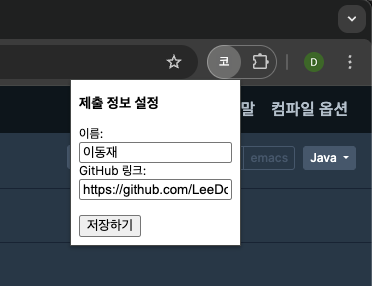
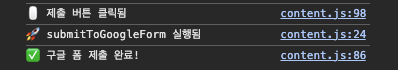

# 🧠 코드카타 자동 제출 크롬 확장 프로그램

프로그래머스에서 코딩테스트 문제를 풀고, **제출 버튼 클릭만으로**  
자동으로 Google Form에 문제 번호 / 코드 / 날짜를 전송합니다.  
**매일매일 자동 기록, 더 이상 수작업 제출은 그만!**

---

## ✨ 주요 기능

- ✅ 프로그래머스 문제 제목 자동 추출
- ✅ 문제 번호 매핑 자동 변환 
- ✅ 작성한 코드 내용 자동 추출 
- ✅ 구글폼에 자동 제출 
- ✅ 사용자는 이름과 GitHub 링크만 설정하면 끝!
- ✅ 모든 항목은 `chrome.storage`로 영구 저장

---

## 📷 시연 이미지

> `popup.html` 설정 화면



> `제출 버튼 클릭 후 자동 제출 완료 로그`



---

## 🛠 설치 방법

1. 이 저장소를 클론하거나 압축을 풀어 로컬에 저장  
```bash
   git clone https://github.com/LeeDongJae-KR/kata-auto-submit.git
```

2. 크롬 주소창에 아래 입력 후 이동
```arduino
chrome://extensions/
```

3. 우측 상단 `개발자 모드` 켜기
4. `압축 해제된 확장 프로그램을 로드` 클릭

---

## ⚙ 설정 방법

1. 크롬 툴바에서 확장 프로그램 아이콘 클릭

2. 이름, GitHub 링크 입력 후 저장

3. 프로그래머스 문제 페이지에서 문제 풀고 **“제출” 버튼만 누르면 자동 제출!**


---

## 📝 개발 구조

|파일|설명|
|---|---|
|`manifest.json`|확장 프로그램 구성|
|`content.js`|문제/코드 추출 및 자동 제출 로직|
|`popup.html / popup.js`|사용자 설정 입력 (이름, GitHub)|
|`data/problem_title_mapping.json`|문제 제목 ↔ 문제번호 매핑 정보|

---
### 🚧 향후 개발 예정

- 🔒 **중복 제출 방지 기능**
    
    - 문제를 동일하게 여러 번 제출하지 않도록 체크 기능 추가 예정
    
- 🪄 **팝업 페이지 UI 개선**
    
    - 활성화 비활성화 버튼 적용 예정
    
- ✅ **제출 완료 확인 페이지 / 팝업 도입**
	- 성공적으로 제출한 뒤, 사용자에게 “제출 완료!” 메시지 페이지나 팝업을 띄워줄 예정  

### ⚠️ 주의사항

- 문제 제목과 JSON 맵핑 데이터가 **완전히 일치해야** 정상 제출됩니다.
    
    - 예: `"두 수의 차"` vs `"두 수의 차 구하기"` → 불일치 시 제출되지 않음
    
- JSON 파일은 `data/problem_title_mapping.json`에서 관리되며, **정기적 수동 업데이트가 필요**합니다.
    
- 제목 불일치 시 `"🛑 매핑된 문제 제목을 찾을 수 없습니다"` 라는 알림이 뜹니다.